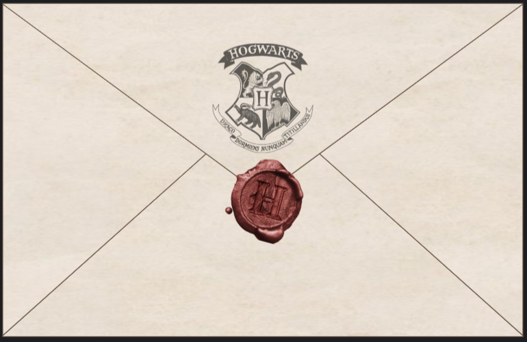

<p align="center">
  
</p>

[](https://github.com/ElvisChenML/hogwarts-letter/stargazers)  [](./LICENSE)

# 🎬 霍格沃茨入学通知书（网页版）

**Hogwarts Acceptance Letter (Web Edition)**

一个以网页形式呈现的魔法体验，模拟你收到霍格沃茨魔法学校入学通知书的过程。

A web-based magical experience that simulates receiving your Hogwarts School of Witchcraft and Wizardry acceptance letter.

本项目以羊皮纸质感、红色火漆封口和动态演示效果再现了经典的霍格沃茨录取信场景，仅供学习或粉丝创作用途。

This project recreates the look and feel of the iconic Hogwarts letter using parchment textures, a wax-sealed envelope, and dynamic presentation effects — designed for personal or fan-based enjoyment.

> 📝 “我们高兴地通知您，您已被霍格沃茨魔法学校录取……”
>
> “We are pleased to inform you that you have been accepted at Hogwarts School of Witchcraft and Wizardry…”

---

## 🖼️ 项目预览 | Preview

> 以下为网页展示效果截图：  
> Below are some preview screenshots of the letter experience:

<p align="center">
  
</p>

---

## ✨ 项目特色 | Features

- 旨在尽可能还原原著中霍格沃茨入学通知书的视觉与交互体验。
  
  Aims to faithfully recreate the visual and interactive experience of receiving the Hogwarts acceptance letter as seen in the original series.
  
- 背景音乐与沉浸式动画流程。
  
  Atmospheric music and immersive animation flow.
  
- 为魔法爱好者和怀旧粉丝而设。
  
  Designed purely for fun, magic, and nostalgia.

---

## 🚀 快速部署 | How to Deploy

### 📌 方法一：通过 GitHub Pages 在线发布  
### 📌 Option 1: Deploy via GitHub Pages (Recommended)

1. Fork 本项目到你的 GitHub 账户  
   Fork this project to your GitHub account  
2. 进入仓库设置 → Pages  
   Go to repository `Settings → Pages`  
3. 选择 `main` 分支作为部署源，路径选择 `/ (root)`  
   Select `main` branch and `/ (root)` folder as source  
4. 保存并等待数分钟，即可通过链接访问  
   Save settings and wait a few minutes. Your page will be available at:  
```

[https://yourusername.github.io/hogwarts-letter/](https://yourusername.github.io/hogwarts-letter/)

````

---

### 🧪 方法二：本地运行  
### 🧪 Option 2: Run Locally

```bash
git clone https://github.com/yourusername/hogwarts-letter.git
cd hogwarts-letter

# macOS
open index.html

# Windows
start index.html

# Linux
xdg-open index.html
````

## ⚠️ 第三方素材免责声明 | Third-party Assets Disclaimer

本项目包含部分第三方素材（如纹理图、校徽、音乐等），仅用于学习、展示或粉丝用途，**不作商业使用**。

This project contains third-party materials (e.g. textures, Hogwarts crest, music) used for educational or fan-based non-commercial purposes.

版权归属：

All rights to:

* *霍格沃茨*、*哈利波特*及其相关名称、图像和标识，均归属 **华纳兄弟娱乐公司** 与 **J.K. 罗琳** 所有。

  *Hogwarts*, *Harry Potter*, and related names, logos, and images belong to **Warner Bros. Entertainment** and **J.K. Rowling**.

* 字体、图像与动画素材来源于公开资源网站。

  Fonts, images, and animations used in this project are sourced from public repositories or free asset websites.

**上述素材不包含在本项目开源许可范围内**，仅作展示用途。

**These third-party assets are NOT covered by the project license** and are used here for demonstration only.

如您是权利人并希望移除某素材，请联系作者。

If you are the rights holder and would like any asset removed, please contact me.

---

## 📜 许可证 | License

本项目的代码部分以 **MIT License** 开源发布。

The code and structure of this project are released under the **MIT License**.

请参阅 [LICENSE](./LICENSE) 文件。

See the [LICENSE](./LICENSE) file for details.