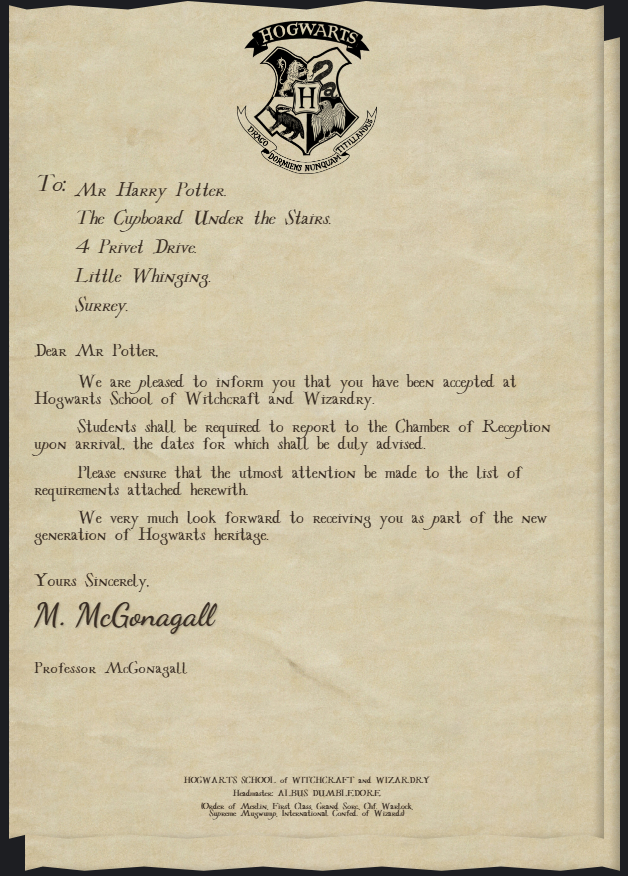
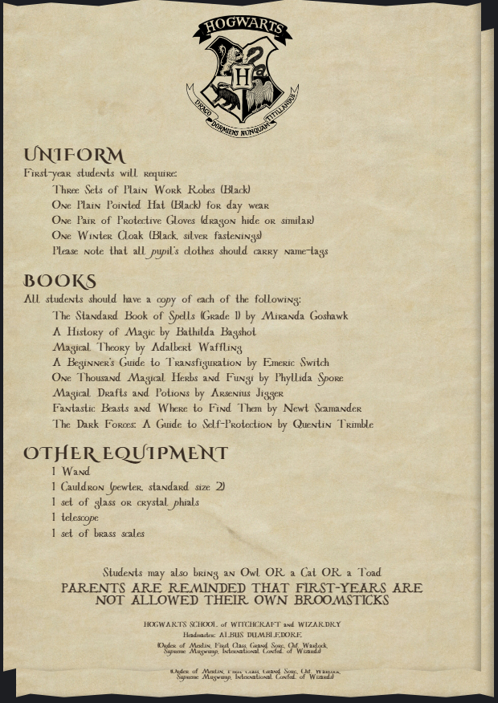

<p align="center">
  
</p>

[](https://github.com/ElvisChenML/hogwarts-letter/stargazers)  [](./LICENSE)

# 🎬 霍格沃茨入学通知书（网页版）

**Hogwarts Acceptance Letter (Web Edition)**

一个沉浸式的魔法体验网页，灵感源自霍格沃茨入学通知书的经典场景，创意演绎了从漂浮羽毛到猫头鹰送信、拆封信件再到阅读录取通知的全过程。虽非完全还原，但每一个细节都注入了独特的魔法氛围与沉浸感。

A fully immersive web-based magical experience inspired by the iconic moment of receiving a Hogwarts acceptance letter. From floating feathers to owl delivery, from unsealing the envelope to reading the notice, the journey is creatively reimagined—every detail infused with a uniquely magical atmosphere.


> 📝 "我们高兴地通知您，您已被霍格沃茨魔法学校录取……"
>
> "We are pleased to inform you that you have been accepted at Hogwarts School of Witchcraft and Wizardry…"

---

## 🖼️ 项目预览 | Preview

> 以下为网页展示效果截图：  
> Below are some preview screenshots of the letter experience:

<p align="center">
  
  
  
</p>

---

## ✨ 项目特色 | Features

### 🎨 沉浸式视觉体验 | Immersive Visual Experience
- **🖋️ 专业字体系统 | Professional Font System**：集成多款魔法主题字体（PrivetDrive、DearMrPotter、Cinzel Decorative等）  
  Integrated with various magical-themed fonts (e.g., PrivetDrive, DearMrPotter, Cinzel Decorative).
- **📜 羊皮纸质感 | Parchment Texture**：高度还原古典羊皮纸质感，营造时代感  
  Realistically simulates classical parchment textures for a vintage feel.
- **🔶 火漆封口 | Wax Seal Design**：精致的霍格沃茨校徽火漆封口设计  
  Delicate Hogwarts crest wax seal design.
- **💌 立体信封 | 3D Envelope Effect**：逼真的3D信封效果，支持开合动画  
  Realistic 3D envelope with open/close animation support.

### 🎭 魔法交互体验 | Magical Interactive Experience
- **🔮 漂浮羽毛入口 | Floating Feather Entrance**：神秘的漂浮羽毛作为魔法世界的入口  
  A mysterious floating feather serves as the portal to the magical world.
- **🦉 猫头鹰送信 | Owl Delivery Animation**：使用Lottie.js制作的精美猫头鹰飞行动画  
  Beautiful owl flight animation powered by Lottie.js.
- **✨ 魔法文字浮现 | Magical Text Reveal**：信件内容逐行魔法般浮现，配合自然过渡动画  
  Letter text appears magically line by line with natural transitions.
- **📃 翻页效果 | Page Flip Animation**：流畅的页面翻转效果，支持前后页切换  
  Smooth page-turning animations with forward/backward navigation.
- **🎵 背景音乐 | Background Music**：Hedwig's Theme主题曲伴随，音量智能淡入  
  Accompanied by “Hedwig’s Theme” with intelligent volume fade-in.
- **👆 直观操作 | Intuitive Controls**：支持拖拽滚动、触摸操作，兼容移动设备  
  Supports drag scrolling, touch controls, and mobile device compatibility.

### 🎯 内容还原度 | Content Authenticity
- **📋 完整信件内容 | Full Letter Content**：包含录取通知书和入学物品清单  
  Includes full admission letter and required items list.
- **🏰 官方视觉风格致敬 | Inspired Visual Style**：基于原著与电影的经典元素进行创意演绎  
  Visual style inspired by the original books and films, creatively reimagined with unique touches.
- **📱 响应式设计 | Responsive Design**：完美适配桌面端和移动端设备  
  Fully responsive across desktop and mobile devices.

### 🛠️ 技术实现 | Technical Implementation
- **🌐 纯前端实现 | Pure Frontend Implementation**：无需后端，可直接部署到静态托管平台  
  No backend required; deployable directly to static hosting platforms.
- **📦 本地资源 | Local Assets**：所有字体、动画、素材均本地化，确保加载速度  
  All fonts, animations, and assets are localized for fast loading.
- **🎨 CSS3动画 | CSS3 Animations**：使用现代CSS3技术实现流畅动画效果  
  Smooth animations built with modern CSS3 techniques.
- **📱 移动优化 | Mobile Optimization**：针对移动设备优化交互体验  
  Interaction experience optimized for mobile devices.

---

## 🚀 快速部署 | How to Deploy

### 📌 方法一：通过 GitHub Pages 在线发布  
### 📌 Option 1: Deploy via GitHub Pages (Recommended)

1. Fork 本项目到你的 GitHub 账户  
   Fork this project to your GitHub account  
2. 进入仓库设置 → Pages  
   Go to repository `Settings → Pages`  
3. 选择 `main` 分支作为部署源，路径选择 `/ (root)`  
   Select `main` branch and `/ (root)` folder as source  
4. 保存并等待数分钟，即可通过链接访问  
   Save settings and wait a few minutes. Your page will be available at:  
```

[https://yourusername.github.io/hogwarts-letter/](https://yourusername.github.io/hogwarts-letter/)

```

---

### 🧪 方法二：本地运行  
### 🧪 Option 2: Run Locally

```bash
git clone https://github.com/yourusername/hogwarts-letter.git
cd hogwarts-letter

# macOS
open index.html

# Windows
start index.html

# Linux
xdg-open index.html
```

---

## 📦 本地化资源说明 | Local Assets Information

所有图像、音频、字体和动画素材均来自网络公开资源：

All image, audio, font, and animation assets are sourced from public web resources:

- **纹理贴图**：羊皮纸、信封纹理等 (Texture maps: parchment, envelope textures, etc.)
- **图标元素**：霍格沃茨校徽、火漆封口、羽毛等 (Icon elements: Hogwarts crest, wax seal, feather, etc.)
- **字体文件**：主题字体、签名字体、正文阅读字体等 (Fonts: theme fonts, signature scripts, body text fonts, etc.)
- **动画素材**：猫头鹰飞行动画、Lottie动画库等 (Animations: owl flight animation, Lottie library, etc.)


---

## ⚠️ 第三方素材免责声明 | Third-party Assets Disclaimer

本项目包含的所有素材（字体、图像、音乐、动画等）均来源于网络公开资源，仅用于学习、展示和粉丝创作用途，**不作任何商业使用**。

All assets included in this project (fonts, images, music, animations, etc.) are sourced from publicly available web resources and are used solely for educational, demonstration, and fan-creation purposes. **No commercial use is intended.**

### 📜 版权归属 | Copyright Attribution

* **霍格沃茨**、**哈利波特**及其相关名称、图像和标识，均归属 **华纳兄弟娱乐公司** 与 **J.K. 罗琳** 所有。

  **Hogwarts**, **Harry Potter**, and related names, logos, and images belong to **Warner Bros. Entertainment** and **J.K. Rowling**.

* **字体文件**：来源于Google Fonts、DaFont等公开字体资源网站

  **Font files**: Sourced from public font resource websites such as Google Fonts and DaFont

* **图像素材**：来源于免费图像资源网站和粉丝创作社区

  **Image assets**: Sourced from free image resource websites and fan creation communities

* **音频文件**：来源于公开的电影原声资源

  **Audio files**: Sourced from publicly available movie soundtrack resources

* **Lottie动画库**：开源JavaScript动画库

  **Lottie animation library**: Open-source JavaScript animation library

**上述第三方素材不包含在本项目开源许可范围内**，仅作展示和学习用途。如您是权利人并希望移除某素材，请联系作者。

**These third-party assets are NOT covered by the project's open-source license** and are used here for demonstration and educational purposes only. If you are the rights holder and would like any asset removed, please contact the author.

---

## 📜 许可证 | License

本项目的代码部分以 **MIT License** 开源发布。第三方素材不包含在开源许可范围内。

The code and structure of this project are released under the **MIT License**. Third-party assets are not covered by the open-source license.

请参阅 [LICENSE](./LICENSE) 文件了解详情。

See the [LICENSE](./LICENSE) file for details.

---

<p align="center">
  <strong>❤️ 献给我心爱的哈利波特迷妻子 | Dedicated to my beloved Harry Potter fan wife ❤️</strong>
</p>